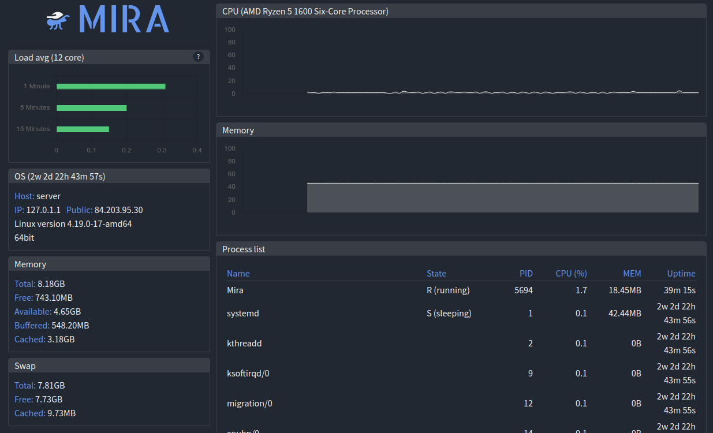
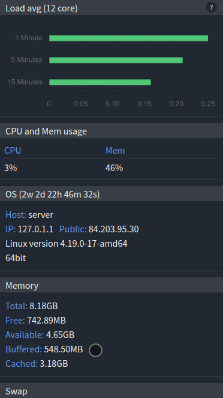

# Mira

[](https://opensource.org/licenses/MIT)

**Mira** lets you monitor your server's resource usage through a responsive WebUI. 

========

* [Introduction](#introduction)
* [Screenshots](#screenshots)
* [Installation](#installation)
* [Limitations](#limitations)
* [Known Issues](#known-issues)

### Introduction

Mira is a tool built to serve a requirement where you can view your headless server's current resource usage but 
without all the additional information found from other applications such as top or htop. 
Mira keeps its 3rd party application dependencies low by reading data from the `/proc` and `/sys` directories (where possible).

Mira aims to be lightweight, fast, and most importantly simple. The WebUI only shows the information that you may be 
interested in such as CPU and Memory usage, running processes and even your docker containers. Updates are delivered 
to your browser using a Websocket connection but will fall back to HttpRequests if the Websocket connection is
unavailable or disabled in the configuration file. 

Mira is a Spanish word that translates into English as "look", "sight", "watch".
 
### Screenshots

#### Desktop


#### Mobile


### Installation

Mira is only available through a docker image. 
Below is a minimal `docker-compose.yml` configuration to get it up and running.

```yaml
version: "3.8"
services:
  mira:
    image: jams246/mira
    container_name: mira
    pid: host # Required to show host system processes and not the containers processes.
    network_mode: host
    volumes:
      - "/var/run/docker.sock:/var/run/docker.sock:ro" # [OPTIONAL] Show docker containers 
```
Visit your server on port `44356` using your favourite browser, and you should see the UI update.

If you want to change the port of the container, define the ports in the `docker-compose.yml` file

```yaml
version: "3.8"
services:
  mira:
    image: jams246/mira
    container_name: mira
    pid: host # Required to show host system processes and not the containers processes.
    ports:
      - "<your desired port>:44356"
      - "44357:44357" #Websocket port
    volumes:
      - "/var/run/docker.sock:/var/run/docker.sock:ro" # [OPTIONAL] Show docker containers
```
Visit your server on port `<your desired port>` using your favourite browser, and you should see the UI update.

### Limitations

#### OS support
* Debian based systems only.

#### Missing features
* HDD temperature readings.
* Network traffic
* Disk IO
* Disable websocket
* Enable debugging

### Known issues

* Resizing the viewport causes the charts to resize.
* Minor visual inconsistencies.